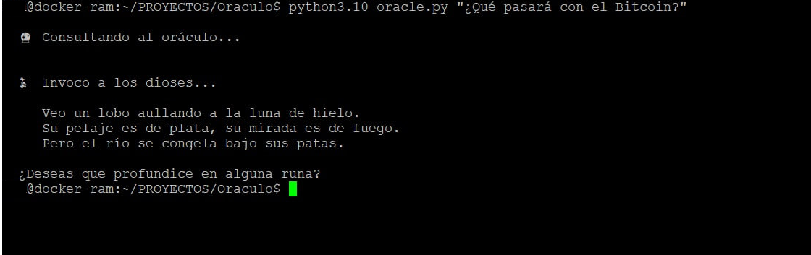

# Oráculo Nórdico

Un oráculo con personalidad de völva vikinga que responde preguntas económicas y de inversión usando metáforas nórdicas. Combina un índice de embeddings semánticos con modelos de lenguaje vía Ollama.

<p align="center">
  
</p>

Inspirado en el Oráculo de Kattegat. Los videntes vikingos son adivinos místicos con poderes sobrenaturales que pueden comunicarse con los dioses y responder preguntas sobre el futuro y el destino de uno en la vida.

## Requisitos

- Python 3.10+
- [Ollama](https://ollama.com) instalado localmente (para el modelo de fallback)
- Una API key de Ollama Cloud (para el modelo principal)

## Instalación

```bash
git clone https://github.com/mar-i0/Oraculo.git
cd Oraculo

python -m venv .venv
source .venv/bin/activate   # Linux/Mac
# .venv\Scripts\activate    # Windows

pip install -r requirements.txt
```

## Configuración

Copia el fichero de ejemplo y añade tu clave:

```bash
cp .env.example .env
# Edita .env y pon tu OLLAMA_API_KEY
```

El repo ya incluye el índice de embeddings precompilado (`style_index/`), así que **no necesitas ejecutar `prepare_style.py` ni `embed.py`**.

## Uso

```bash
# Pregunta simple
python oracle.py "¿Qué presagias para los mercados este trimestre?"

# Con un PDF adjunto (informe, earnings, etc.)
python oracle.py "¿Qué auguras para esta empresa?" -f informe.pdf
python oracle.py "Dos gigantes se fusionan" -f empresa_a.pdf -f empresa_b.pdf
```

## Estructura

```
Oraculo/
├── oracle.py          # CLI principal
├── config.py          # Configuración de modelos y rutas
├── prepare_style.py   # Extrae y fragmenta los textos fuente → chunks.json
├── embed.py           # Genera embeddings desde chunks.json → index.npy
├── system_prompt.txt  # Personalidad del vidente
├── requirements.txt
├── .env.example
└── style_index/       # Índice precompilado (incluido en el repo)
    ├── chunks.json    # Fragmentos de texto
    └── index.npy      # Vectores de embeddings
```

## Modelos

| Rol | Modelo | Descripción |
|-----|--------|-------------|
| Principal | `gemma3:12b` (Ollama Cloud) | Respuestas de calidad |
| Fallback | `qwen2.5:1.5b` (local) | Requiere Ollama local |
| Embeddings | `all-MiniLM-L6-v2` | HuggingFace, se descarga automáticamente |

## Ejemplo

<p align="center">
  
</p>

Ejemplo de predicción sobre BTC. La idea es que pueda hacer predicciones económicas pasándole un pdf de la prensa económica como Expansión.

## Re-indexar con tus propios documentos

Si quieres añadir tus propios textos al índice:

1. Pon tus PDFs/EPUBs en `Mediums/` o `Inversión/`
2. `python prepare_style.py`
3. `python embed.py`
4. `python oracle.py "tu pregunta"`
